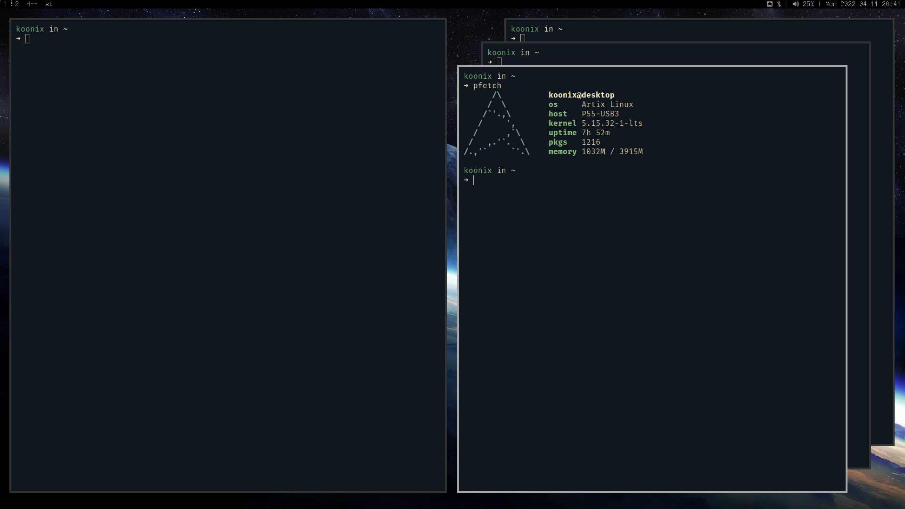

# dwm

this is my build of dwm, a tiling window manager:
[dwm.suckless.org](https://dwm.suckless.org)

## patches

- [systray](https://dwm.suckless.org/patches/systray)

- [pertag-ng](https://github.com/ghesy/dwm/commit/7816cfb)

- [swallow](https://dwm.suckless.org/patches/swallow)

- [sametagrule](https://github.com/ghesy/dwm/commit/fb1e103)

- [blockinputrule](https://github.com/ghesy/dwm/compare/36f4be5...b4d681d)

- [fixjumprule](https://github.com/ghesy/dwm/commit/5643525)

- [nmasterbias](https://github.com/ghesy/dwm/commit/601138f)

- [switchcol](https://dwm.suckless.org/patches/switchcol)

- [push](https://dwm.suckless.org/patches/push)

- [attachdirection](https://dwm.suckless.org/patches/attachdirection)

- [transfer](https://dwm.suckless.org/patches/transfer)

- [actualfullscreen](https://dwm.suckless.org/patches/actualfullscreen)

- [pwkl](https://dwm.suckless.org/patches/pwkl)

- [adjacent](https://github.com/ghesy/dwm/commit/7310263)

- [fixjump](https://github.com/ghesy/dwm/commit/5643525)

- [eventtimer](https://github.com/ghesy/dwm/commit/73b3f78)

- [urgentborder](https://dwm.suckless.org/patches/urgentborder)

- [dualborders](https://github.com/ghesy/dwm/commit/b375ca9)

- [ewmhtags](https://dwm.suckless.org/patches/ewmhtags)

- [NET_WM_DESKTOP hint](https://github.com/ghesy/dwm/compare/cc4564f...5ce1409)

- [clientindicatorshidevacant](https://dwm.suckless.org/patches/clientindicators) +
[cindfact](https://github.com/ghesy/dwm/commit/4a33fd9)

- [status2d + swap-save-restore](https://dwm.suckless.org/patches/status2d)

- [titlecolor](https://dwm.suckless.org/patches/titlecolor)

- [stairs](https://dwm.suckless.org/patches/stairs)

- [bidi](https://dwm.suckless.org/patches/bidi)

and many other minor additions, changes and fixes.

## related stuff

- my statusbar: [soystemd/dwmBar](https://github.com/ghesy/dwmbar)
- my dotfiles: [soystemd/dotfiles](https://github.com/ghesy/dotfiles)
