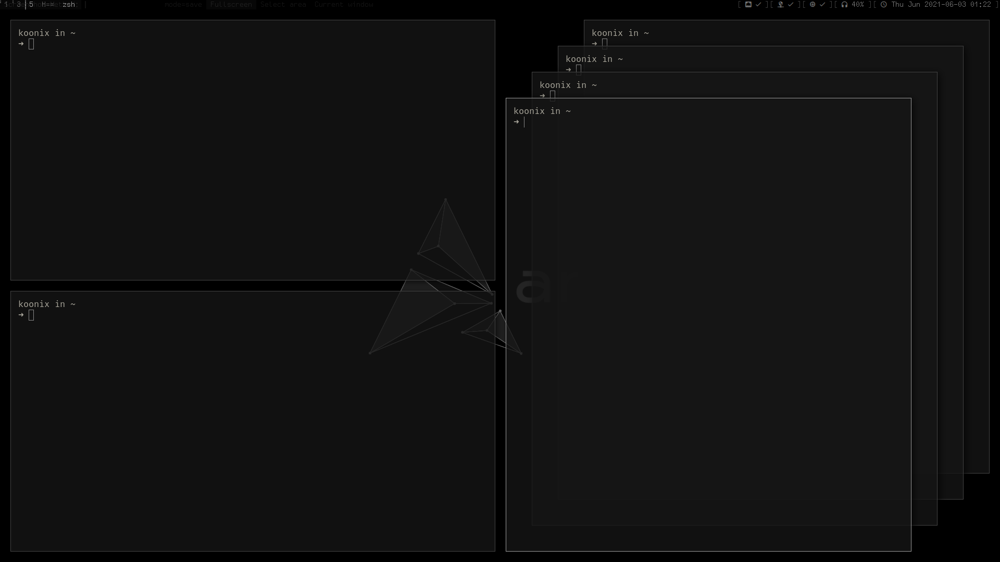

# dwm

this is my build of dwm, the tiling window manager:
[dwm.suckless.org](https://dwm.suckless.org)

## patches

utility:

- [swallow](https://dwm.suckless.org/patches/swallow)
(patched to support tmux)

- [switchcol](https://dwm.suckless.org/patches/switchcol)
(improved it's visiblity a little bit)

- [push](https://dwm.suckless.org/patches/push)

- [attachdirection](https://dwm.suckless.org/patches/attachdirection)

- [transfer](https://dwm.suckless.org/patches/transfer)

- my stairs layout (on the second screenshot)

vanity:

- [clientindicators](https://dwm.suckless.org/patches/clientindicators)
(the "hide vacant" variant)

- [status2d](https://dwm.suckless.org/patches/status2d)
(and it's "swap-save-restore" patch)

- [vanitygaps-cfacts](https://dwm.suckless.org/patches/vanitygaps)

- [float-border-color](https://dwm.suckless.org/patches/float_border_color)

- [titlecolor](https://dwm.suckless.org/patches/titlecolor)

## requires libxft-bgra

This build of dwm does not block color emoji in the status/info bar,
so you must install libxft-bgra from the AUR,
which fixes a libxft color emoji rendering problem,
otherwise dwm will crash upon trying to render one.
Hopefully this fix will be in all libxft soon enough.

## related stuff

- my statusbar: [soystemd/dwmBar](https://github.com/soystemd/dwmbar)
- my dotfiles: [soystemd/dotfiles](https://github.com/soystemd/dotfiles)
